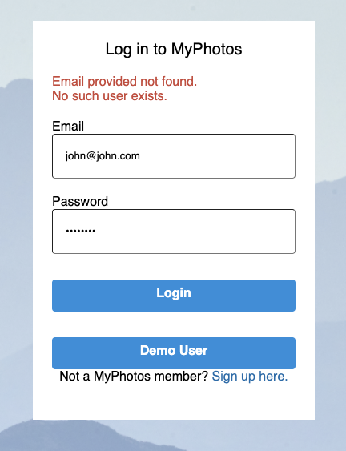
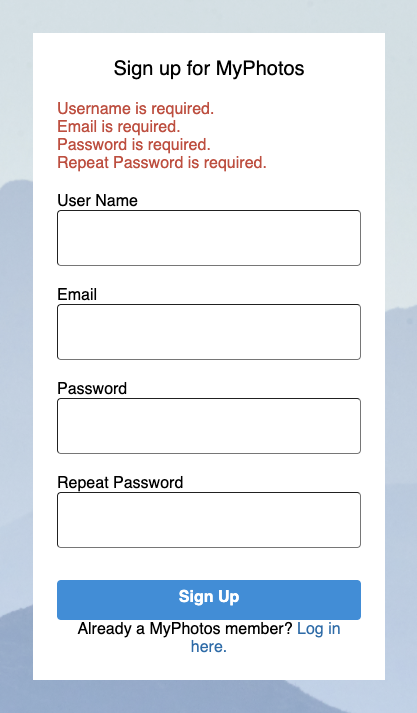
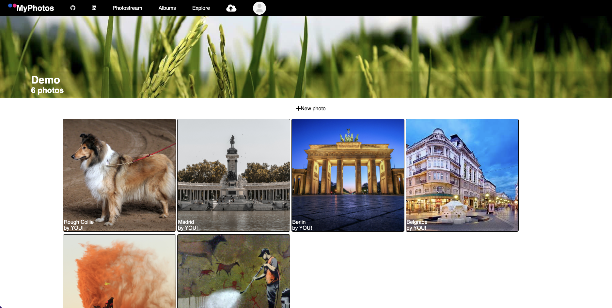
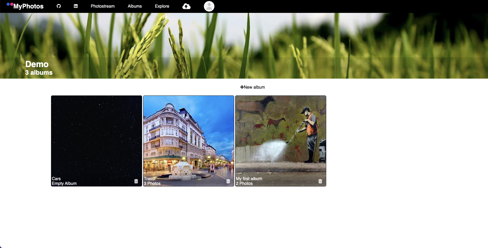
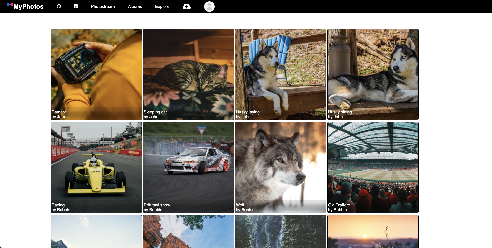

# MyPhotos
MyPhotos is a full-stack application inspired by Flickr. It is an image hosting platform where users can upload their photos. Users can also create albums for better organization of their photos.

[Visit the site live here!](https://my-photos-application.herokuapp.com/)

* [Feature List](https://github.com/srvorkap/MyPhotos/wiki/Feature-List)
* [User Stories](https://github.com/srvorkap/MyPhotos/wiki/User-Stories)
* [Database Schema](https://github.com/srvorkap/MyPhotos/wiki/Database-Schema)

# Technologies Used

- Python
- Flask
- React
- Redux
- HTML
- CSS
- Node
- Postgres
- Sequel Alchemy
- JavaScript
- Docker
# Getting Started

1. Clone the repository

       git clone git@github.com:srvorkap/MyPhotos.git

2. CD into the root directory and install dependencies

        pipenv install --dev -r dev-requirements.txt && pipenv install -r requirements.txt

3. Create a .env file based on the example with proper settings for your development environment

4. Setup your PostgreSQL user, password and database and make sure it matches your .env file

5. Start your environment shell

         pipenv shell

6. Migrate your database

         flask db upgrade

7. Seed your data

         flask seed all

8. Run the flask app

         flask run

9. Open second terminal, cd into /react-app directory and install dependencies with command

         npm install

10. Run the React app

         npm start

# Features

## Landing Page
New users can click on start button or sign up button which will take them to the sign up page. Existing users can click on login button in navbar that will take them to the login page.

## Login Page

On login page there is also a demo button which will allow someone to quickly sign up as a demo user and explore the site.
Error handling login page.

## Signup page

Error handling for signup page

## Navbar

Navbar is visible on every page. There is difference between navbar when user is logged in and when user is logged out. I both cases navbar has logo that cannot be clicked and github and linkedin about links.
# Navbar for logged out users

Navbar has login and signup buttons when user is logged in.

# Navbar for logged in users

Navbar doesn't have login and signup buttons when user log in but it has some additional buttons.

1. Photostream button - navigates to photostream page
2. Albums button - navigates to albums page
3. Explore button - navigates to explore page
4. Upload button - opens create photo form
5. Profile button - opens menu that gives us an option to logout

</img>

## Photostream

Once logged in user is redirected to photostream page where he can see all photos uploaded by him. He can click on each photo and open individual photo page.

</img>

## Albums

Albums page contains the list of all albums of the current user. Each individual album can be deleted (with all photos that it contains) by clicking the trash can icon. Also each album can be opened on its own page with the list of all photos that belong to that album.

</img>

## Explore

Explore page contains the list of all photos that don't belong to the current user. Current user can open individual photos but he can't edit or delete them.

</img>
